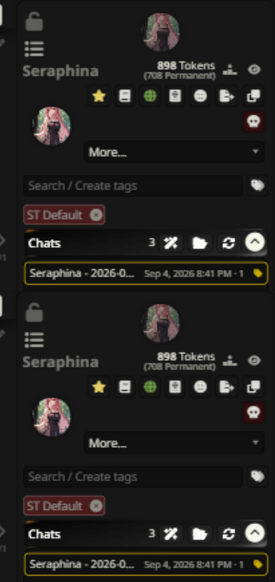
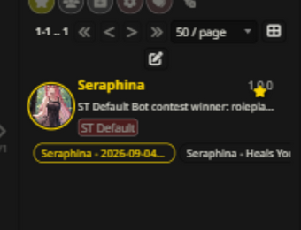
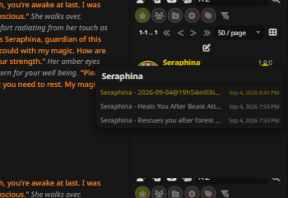

# Quick Chat Selector for SillyTavern

Quick Chat Selector makes switching between a character's chats fast. It adds a chat selector to the character management drawer, shows the most recent chats right under each card in the character list, and adds a right-click chat picker to the favorite star and the HotSwaps strip. It can also rename your chats with short, descriptive labels generated by your LLM.

## Table of Contents

- [Features](#features)
- [Screenshots](#screenshots)
- [Installation](#installation)
- [Usage](#usage)
- [⚙️ Settings](#️settings)
- [Troubleshooting](#troubleshooting)
- [License](#license)
- [Contributing](#contributing)
- [❤️ Support the Project](#️-support-the-project)

## Features

### 📂 Chat Section in the Character Editor

Adds a collapsible *Chats* section to the character management drawer, right between the tags and the Creator's Notes. It lists every chat sorted by last activity with date and message count, highlights the currently open chat, and switches to another chat with a single click. The header has a button to open SillyTavern's full "Manage chat files" dialog and one to refresh the list.

### 🏷️ Recent Chats Under Cards

In the character list, the most recent chats of each character (and group) appear as a single non-wrapping line of chips under the card. The line scrolls horizontally when it overflows, the active chat is highlighted, and clicking a chip selects that character and opens that chat.

### ⭐ Chat Picker on the Favorite Star

Right-click (or long-press on touch) the favorite star on a card — or a favorite avatar in the HotSwaps strip on top of the character panel — to open a compact chat picker menu at the cursor and jump straight to a chat. The star sits in the card's top-right corner; favorited characters always show it.

### 🪄 AI Chat Renaming

The *Chats* section has a magic-wand button that renames chats with the help of your LLM. For every unmarked chat it sends the first 10 messages (one call per chat, no chat history or world info is sent) and renames the chat to a compact `Name - Description` label: the first name of the main female character when one is present, plus up to 12 words describing what the chat is about. Names are front-loaded so the important parts survive truncation. Renamed chats get a golden tag marker stored on the character card and are skipped on subsequent runs; click a tag to unmark a chat so it gets renamed again next time.

## Screenshots

The chat section in the character editor, between tags and Creator's Notes — two chats renamed by AI (golden tags), one still pending:



Recent chats as a single-line selector under each card in the character list:



Right-click the favorite star for a compact chat picker:



## Installation

Install via SillyTavern's Extension Manager using this repository URL:

```
https://github.com/Samueras/QuickChatSelector-Extension/
```

No core files are modified — everything is injected at runtime.

## Usage

- **Switch chats:** click a row in the editor's *Chats* section, a chip under a card, or an entry in the star / HotSwaps chat picker.
- **Rename with AI:** open a character, expand the *Chats* section and click the wand. Confirm the dialog and let it run — progress is shown in the section while the wand spins.
- **Markers:** a golden tag next to a chat means it has been renamed by AI and will be skipped. Click the tag to unmark it and include the chat in the next run.

## ⚙️ Settings

Found in **Extensions → Quick Chat Selector**:

| Setting | Default | Description |
|---|---|---|
| Show chat selector in character editor | on | The *Chats* section in the character management drawer |
| Show recent chats under cards in the list | on | The chip line under each card |
| Chat picker on favorite star (right-click / long-press) | on | The context menu on stars and HotSwap avatars |
| Chats shown per card | 5 | 1–10 chips per card line |

## Troubleshooting

- **AI rename fails with "Check that an API connection is configured"** — the extension uses your currently active API connection. Connect a backend first, then try again.
- **A chat could not be renamed** — the LLM returned an empty or refused answer for that chat (some models decline adult content). The chat stays unmarked and is retried on the next run; try a different model or rename it manually.
- **The drawer section doesn't show** — it only appears when a character is selected and the form is in edit mode; select a character first.

## License

This project is licensed under the GNU General Public License v3.0 — see the [LICENSE](LICENSE) file.

## Contributing

Issues and pull requests are welcome. Please describe the expected behavior, what happened instead, and your SillyTavern version.

## ❤️ Support the Project

If you find this extension useful, please consider supporting my work:

☕ [Ko-fi](https://ko-fi.com/samueras)
